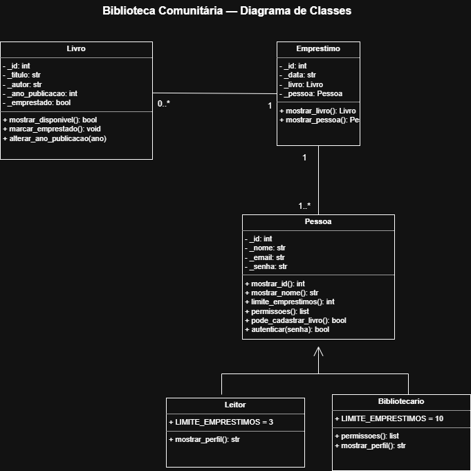

## PROJETO BIBLIOTECA COMUNITÁRIA 
# NATALY GABRIELY E DEBORA MIRANDA

Sistema de controle de acervo e empréstimos de um ponto de leitura de bairro.
O sistema garante:

1. Controle do acervo (livros e se estão disponíveis).
2. Registro de empréstimos (quem pegou qual livro e quando).
3. Limites diferentes: leitor até 3 empréstimos ativos; bibliotecário até 10.
4. Regras de Negócio: Não emprestar livro já emprestado; ano de publicação válido; só quem tem permissão `cadastrar_livro` inclui livro novo.

## DESENVIMENTO DA ARQUITETURA MVC E CONFIGURANDO O AMBIENTE FastAPI
Criado os arquivos da arquitetura MVC: app > controllers> data > models > routes
Criado o ambiente virtual utilizando o comando python -m venv venv e ativando o ambiente com o comando venv\Scripts\activate 
Criado e realizado o congelamento de dependências, após a criação do ambiente venv, com o comando pip freeze > requirements.txt 
Por último, realizado a instalção do pacote de dependências utilizando o comando ip install -r requirements.txt

## DIAGRAMA DE CLASSES
O diagrama abaixo representa a estrutura do sistema Biblioteca Comunitária, incluindo as classes Livro, Emprestimo e Pessoa, além das especializações Leitor e Bibliotecario.

## IMPLEMENTAÇÕES

Implementação dos dados mockados de emprestimo, livro e pessoas na camada data.
Implementação na camada model, criando os arquivos  pessoa.py, livro.py, conflito.py contendo as classes e seus métodos, na camada pessoa foi implementado a classe principal pessoa e suas subclasses bibliotecario e leitor

ROODAR O CÓDIGO: uvicorn main:app --reload

